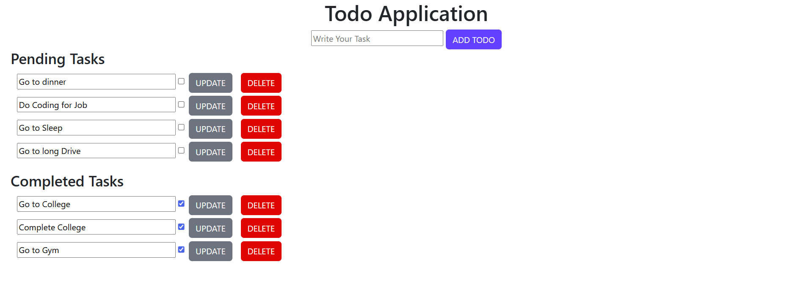

# 📝 Todo Application

A simple and interactive **Todo List Application** built using **Spring Boot, JSP, MySQL, HTML, and CSS**.  
This app allows users to add, update, delete, and manage tasks as **Pending** or **Completed**.

---

## 🚀 Features
- ➕ Add new tasks  
- ✅ Mark tasks as completed  
- 🔄 Update existing tasks  
- ❌ Delete tasks  
- 📂 Separate sections for **Pending** and **Completed** tasks  
- 💾 Data stored in **MySQL Database**  
- 🎨 Styled using CSS for better UI  

---

## 🖥️ Tech Stack
- **Backend:** Spring Boot  
- **Frontend:** JSP, HTML, CSS  
- **Database:** MySQL  
- **Build Tool:** Maven  

---

## 📸 Screenshot


---

## ⚙️ Setup Instructions

### 1. Clone the repository
```bash
git clone https://github.com/your-username/todo-application.git
cd todo-application
```

### 2. Configure Database
- Create a MySQL database (e.g., `todo_db`)
- Update `application.properties` with your MySQL credentials:
```properties
spring.datasource.url=jdbc:mysql://localhost:3306/todo_db
spring.datasource.username=your_username
spring.datasource.password=your_password
spring.jpa.hibernate.ddl-auto=update
```

### 3. Run the Application
```bash
mvn spring-boot:run
```

### 4. Access the App
Open browser and visit:  
👉 `http://localhost:8080/`

---

## 📂 Project Structure
```
├── src
│   ├── main
│   │   ├── java/com/example/todo   # Java source code (Controllers, Services, Models, Repository)
│   │   ├── resources
│   │   │   ├── application.properties  # Configurations
│   │   │   └── static/css              # CSS files
│   │   │   └── templates/*.jsp         # JSP views
├── pom.xml   # Maven dependencies
```

---

## 🛠️ Future Improvements
- 🔐 User authentication (Login/Signup)  
- 📱 Responsive UI (Mobile-friendly)  
- ⏰ Due date and reminder feature  
- 🌐 Deploy on cloud (Heroku/AWS)  

---

## 🤝 Contributing
Pull requests are welcome!  
For major changes, please open an issue first to discuss what you’d like to change.

---

## 📜 License
This project is licensed under the **MIT License**.

---
